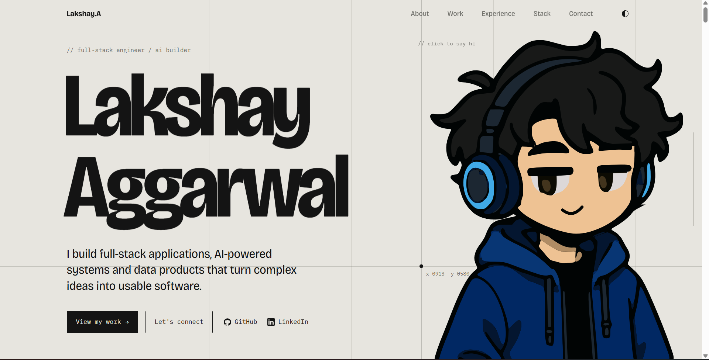

# Mukund Kumar - Developer Portfolio

<p align="center">
  
</p>

<p align="center">
  <strong>Full-Stack Developer · AI Builder</strong>
</p>

<p align="center">
  <a href="https://lakshayaggarwal.vercel.app">Live Portfolio</a>
  ·
  <a href="https://github.com/shivam-jha-89">GitHub</a>
  ·
  <a href="https://www.linkedin.com/in/shivam-kumar-426a86385/">LinkedIn</a>
</p>

---

## About

A personal developer portfolio built to showcase selected projects, engineering experience, technical capabilities, and achievements through a responsive, motion-focused interface.

The site is intentionally built without a UI framework, with the emphasis on **clean structure, responsive behavior, accessibility, and interaction design**.

## Highlights

* Responsive design across desktop, tablet, and mobile
* Light and dark themes with persisted preferences
* Motion-based section transitions and interactions
* Project showcase with technology, metadata, stages, and live demos
* Experience and achievement sections
* Accessible navigation, focus states, skip links, and reduced-motion support
* SEO and Open Graph metadata
* Responsive typography and custom design system
* Production deployment on Vercel

## Tech Stack

| Technology     | Purpose                                           |
| -------------- | ------------------------------------------------- |
| **React 19**   | UI and component architecture                     |
| **Vite**       | Development and production tooling                |
| **JavaScript** | Application logic and content                     |
| **CSS**        | Layout, themes, animations, and responsive design |
| **Motion**     | UI transitions and interactive motion             |
| **Prettier**   | Code formatting                                   |

## Architecture

```text
src/
├── components/     Reusable UI components
├── data/           Portfolio content and project data
├── hooks/          Custom React hooks
├── sections/       Portfolio page sections
├── styles/         Global styles and design system
├── App.jsx         Application composition
└── main.jsx        Entry point

public/
├── favicon.svg
├── og.png
├── portfolio-preview.png
└── resume.pdf
```

Content is separated from presentation, making projects, experience, skills, and profile information easy to update without modifying the core UI.

## Getting Started

### Requirements

* Node.js 18+
* npm

### Installation

```bash
git clone https://github.com/Shivam Kumar/Portfolio.git
cd Portfolio
npm install
```

### Development

```bash
npm run dev
```

The development server runs at:

```text
http://localhost:5173
```

### Production Build

```bash
npm run build
npm run preview
```

### Formatting

```bash
npm run format
```

## Content

Portfolio content is managed through dedicated data files:

```text
src/data/profile.js
src/data/projects.js
src/data/experience.js
src/data/skills.js
```

Global visual configuration is primarily handled through:

```text
src/styles/global.css
```

## Deployment

The portfolio is deployed using **Vercel**.

The project uses the standard Vite production workflow:

```bash
npm run build
```

The generated `dist/` directory contains the production build.

## License

This repository contains personal branding, portfolio content, project information, and assets belonging to Kumar Aggarwal.

The source code may be referenced for learning, but personal content, branding, project descriptions, resume, and assets should not be reused as-is.

---

<p align="center">
  Built with React, CSS, Motion, and a questionable number of iterations.
</p>
